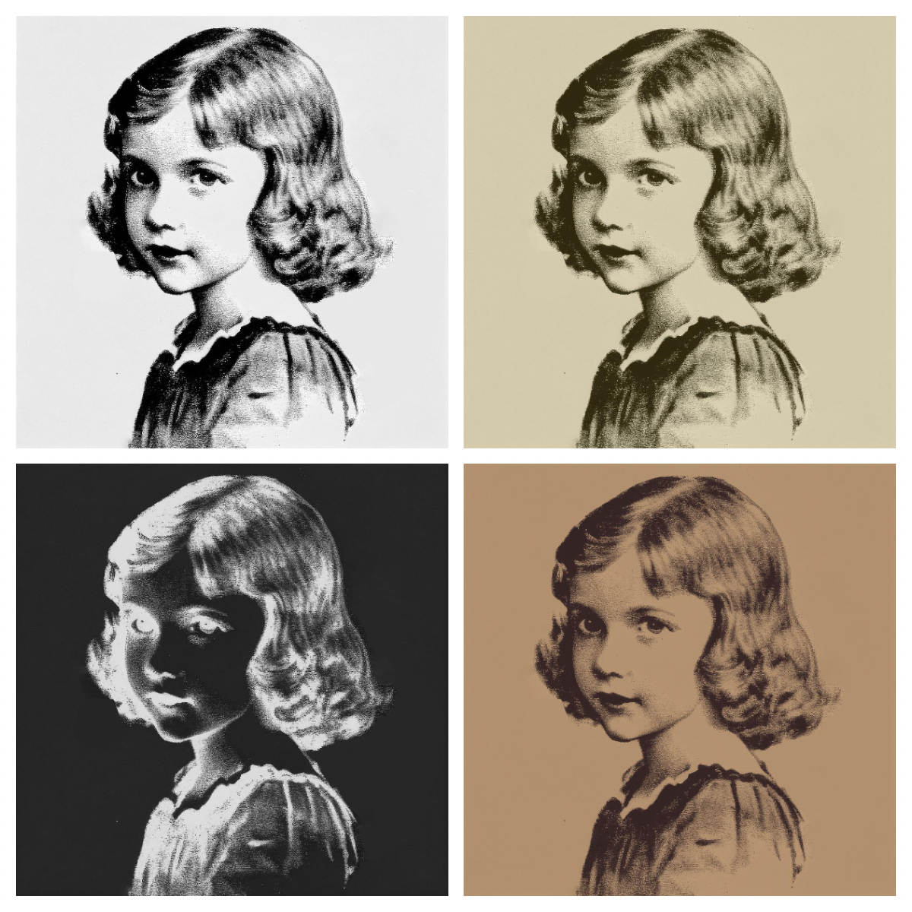

# Paper

Paper is a Go library to simulate monochromic old print papers, as shown in the following sample picture.



## Getting Started

The `Paper` struct defined in this library implements the `draw.Image` interface; i.e. it can be used as a drawing canvas to overlay images and to draw shapes and texts.

_Note_: The `Paper` needs to be `Mask`-ed and `Unmask`-ed before and after the drawing is done for paper theme to be applied correctly.

```go
import "github.com/aslrousta/paper"

p := paper.New(paper.Nostalgia, 800, 300)

p.Mask()
draw.Draw(p, p.Bounds(), im, image.Point{0, 0}, draw.Src)
p.Unmask()
```
